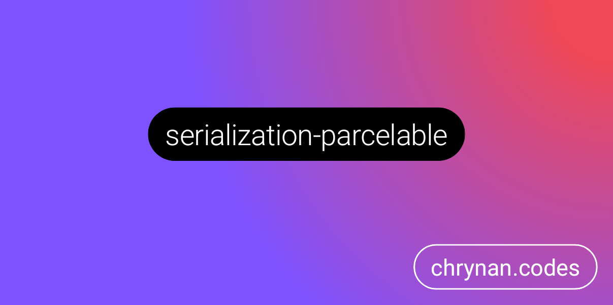
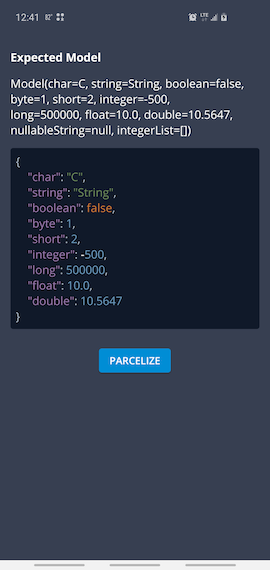
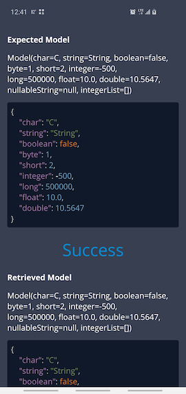

# parcelable

Android Parceling support for the [Kotlinx Serialization library](https://github.com/Kotlin/kotlinx.serialization).
<br/>
<a href="https://androidweekly.net/issues/issue-450"></img></a>

```kotlin
// Add to Android Intent
intent.putExtra(name = "com.example.MyModel", value = myModel, serializer = MyModel.serializer())

// Retrieve from Android Intent
val result = intent.getParcelableExtra(name = "com.example.MyModel", deserializer = MyModel.serializer())

check(result == myModel) // True

// Compose
val result = rememberSavable(serializer = MyModel.serializer()) { MyModel(...) }
```

All serialization for an Android or Multi-platform project can be handled from a single library, no need to create both
custom Android Parcelers and Serializers. Use
the [Kotlinx Serialization library](https://github.com/Kotlin/kotlinx.serialization), and it will automatically work
with Android's `Parcel`, `Bundle`, and `Intent`.

## Getting Started 🏁

The library is provided through [Repsy.io](https://repsy.io). Checkout
the [releases page](https://github.com/chRyNaN/parcelable/releases) to get the latest version. <br/>


### Repository

```kotlin
repositories {
    maven { url = uri("https://repo.repsy.io/mvn/chrynan/public") }
}
```

### Dependency

#### Core

```kotlin
implementation("com.chrynan.parcelable:parcelable-core:$VERSION")
```

#### Compose

```kotlin
implementation("com.chrynan.parcelable:parcelable-compose:$VERSION")
```

## Usage 👨‍💻

### Set up the `Parcelable` object

Similar to the `Json` object introduced by
the [Kotlinx Serialization library](https://github.com/Kotlin/kotlinx.serialization), this library introduces a
`Parcelable` object. The extension functions default to using the `Parcelable.Default` value if a `Parcelable` instance
is not provided, but if customization is required, an instance can be created as follows:

```kotlin
val parcelable = Parcelable {
    serializersModule = mySerializersModule
}
```

### Use [Kotlinx Serialization](https://github.com/Kotlin/kotlinx.serialization)

Utilize the [Kotlinx Serialization](https://github.com/Kotlin/kotlinx.serialization) to serialize your model classes.
These classes can then be used with Android's `Bundle`, `Intent`, and `Parcel` objects.

```kotlin
@Serializable
data class MyModel(
    val intField: Int,
    val stringField: String,
    val nullableStringField: String? = null
)
```

### Encode and decode models

#### `Intents` and `Bundles`

```kotlin
// Put
intent.putExtra(key, myModel, parcelable)
bundle.putParcelable(key, myModel, parcelable)

// Get
val myModel = intent.getParcelableExtra(key, parcelable)
val myModel = bundle.getParcelable(key, parcelable)
```

#### `Parcels` and `Bundles`

```kotlin
// To
parcelable.encodeToParcel(parcel, myModel)
val bundle = parcelable.encodeToBundle(myModel)

// From
val myModel = parcelable.decodeFromParcel(parcel)
val myModel = parcelable.decodeFromBundle(bundle)
```

#### `Saver` with Jetpack Compose

```kotlin
val model = rememberSavable(parcelable = parcelable, serializer = MyModel.serializer) { myModel }
```

### Multiplatform

This library is a Kotlin Multi-platform library and supports Android, iOS, JVM, and JS Kotlin targets. The `Parcelable`
and `Parcel` objects are available in the common source set and can be used to encode and decode models. Then, in
platform specific code, the `Parcels` can be stored and retrieved between different components (ex: Android Intents).

```kotlin
// Common Code
val parcel = parcelable.encodeToParcel(serializer = MyModel.serializer(), value = myModel)

// Android Code
Bundle().readFromParcel(parcel)
```

## Documentation 📃

More detailed documentation is available in the [docs](docs) folder. The entry point to the documentation can be
found [here](docs/index.md).

## Sample

The `sample-android` module contains an Android App showcasing the use of this library and providing a means to test
parceling different models.

Simply update the `ExpectedModel.model` value to be any Serializable class and run the application to test if the
parceling worked.

### Sample Screenshots




## Security 🛡️

For security vulnerabilities, concerns, or issues, please responsibly disclose the information either by opening a
public GitHub Issue or reaching out to the project owner.

## Contributing ✍️

Outside contributions are welcome for this project. Please follow the [code of conduct](CODE_OF_CONDUCT.md)
and [coding conventions](CODING_CONVENTIONS.md) when contributing. If contributing code, please add thorough documents.
and tests. Thank you!

## Sponsorship ❤️

Support this project by [becoming a sponsor](https://www.buymeacoffee.com/chrynan) of my work! And make sure to give the
repository a ⭐

## License ⚖️

```
Copyright 2021 chRyNaN

Licensed under the Apache License, Version 2.0 (the "License");
you may not use this file except in compliance with the License.
You may obtain a copy of the License at

   http://www.apache.org/licenses/LICENSE-2.0

Unless required by applicable law or agreed to in writing, software
distributed under the License is distributed on an "AS IS" BASIS,
WITHOUT WARRANTIES OR CONDITIONS OF ANY KIND, either express or implied.
See the License for the specific language governing permissions and
limitations under the License.
```
